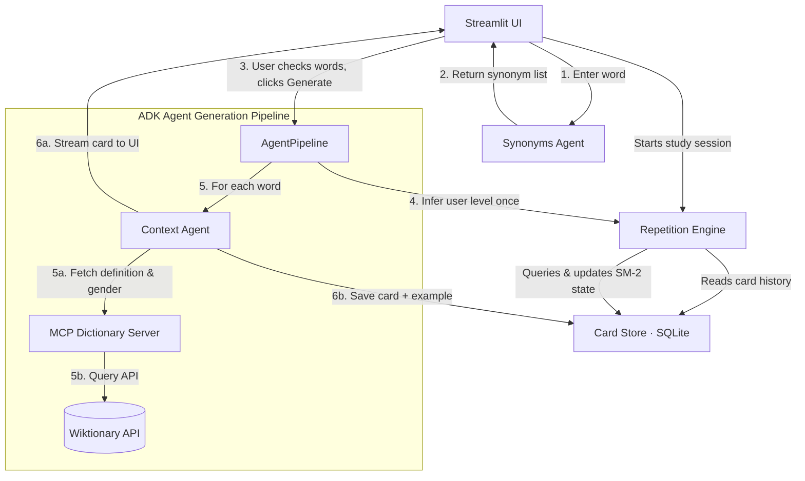

# EchoLoop — Multi-Agent Flashcard Generator for German Learners

<!-- Track: Agents for Good (education) -->
<!-- Word budget: ≤ 2,500 words total -->

---

## 1 Motivation

I live and work in Germany many years already.
Over that time I have studied German on many different levels and tried many different methods and apps.
Unfortunately, none of the existing apps (e.g. Duolingo, Memrise, Anki) satisfied my needs.
I study language with a private tutor.
After each lesson I leave with a list of words and phrases to memorize.
Creating flashcards from this list is time consuming.
Besides, I believe two features are missing in the existing apps.
First, memorizing words and their direct translations is far less efficient than memorizing them in the context of a natural sentence.
Second, expanding into synonyms is extremely useful for building a rich vocabulary.
So, I decided to build a flashcard app that solves these problems.

In addition, I work as a data scientist and ML engineer but until recently avoided using LLMs and especially agentic coding in my day-to-day work.
This kaggle competition seemed to be a great opportunity to change that and I must admit, I was not disappointed.
I have learned a lot and got a huge boost in my productivity and confidence in using agentic tools.

## 2 Problem Statement

Intermediate-to-advanced language learners hit a plateau that mainstream flashcard apps cannot solve. Apps like Duolingo lock users into a fixed curriculum of pre-packaged phrases, making them useless for vocabulary encountered in real conversations, university lectures, or professional contexts. Anki offers full flexibility but demands tedious manual card creation — typing definitions, finding example sentences, and looking up grammatical genders by hand. Neither approach generates contextual sentences calibrated to the learner's proficiency, and neither expands a single word into a cluster of related synonyms automatically.

The core problem: **there is no flashcard tool that takes a single German word from a real-life encounter and instantly produces verified, level-appropriate, contextual study material — complete with synonyms, grammatical metadata, and spaced repetition scheduling.**

## 3 Solution Overview

EchoLoop is an AI-powered flashcard application that closes this gap. A user types any German word they have encountered. A multi-agent pipeline — built with Google's Agent Development Kit (ADK) — takes over: one agent proposes synonyms, another generates level-calibrated example sentences grounded by verified dictionary data from the Wiktionary API via a Model Context Protocol (MCP) server. Cards are stored in a normalized SQLite database and scheduled for review using the SuperMemo-2 (SM-2) spaced repetition algorithm.

| Dimension | Duolingo | Anki | Lingvist | **EchoLoop** |
| :--- | :--- | :--- | :--- | :--- |
| Card Generation | Static database | Manual creation | Static database | **Dynamic (Multi-Agent Pipeline)** |
| Vocabulary Source | Fixed curriculum | User-supplied | Fixed curriculum | **User-supplied (any word)** |
| Recall Context | Repetitive phrases | Plain text | Cloze sentences | **Level-Targeted Sentences** |
| Expansion Flow | None | Manual search | None | **Interactive Synonym Checklist** |
| External Verifier | None | None | None | **Wiktionary API via MCP** |
| Cost | Ad-supported/Paid | Free | Subscription | **$0.00 (scale-to-zero GCP)** |

### 3.1 Why Agents?

A single monolithic LLM prompt could attempt all tasks at once, but it would conflate responsibilities: synonym generation, definition verification, difficulty estimation, and sentence composition would all compete for attention in one context window. Errors in one step (e.g. a hallucinated gender) would silently propagate to the output with no chance of correction.

A multi-agent architecture solves this by assigning each responsibility to a focused agent with its own prompt, tools, and output schema:

- The **Synonyms Agent** operates as a pure lexicographer — it only proposes related words, validated against a strict Pydantic schema.
- The **Context Agent** is an expert teacher — it first calls the MCP dictionary tool to retrieve verified definitions and grammatical genders, then composes sentences grounded in that factual data.
- The **AgentPipeline** orchestrator handles sequencing, deduplication, error isolation, and streaming results to the UI.

This separation of concerns makes each agent independently testable, individually tuneable, and resilient to partial failures — if one word fails, the batch continues.

### 3.2 Key Features

- **Instant card generation**: Enter any German word → receive a flashcard with translation, CEFR level, and a contextual example sentence within seconds.
- **Synonym expansion**: The Synonyms Agent proposes up to 5 related words. Users select which ones they want via an interactive checklist before batch-generating cards.
- **MCP-verified definitions**: A local FastMCP server queries the Wiktionary API to retrieve exact grammatical genders (`der`/`die`/`das`) and English definitions, eliminating hallucinated translations.
- **Adaptive difficulty**: The Repetition Engine dynamically infers the user's CEFR level from the distribution of existing cards and instructs the Context Agent to compose sentences at the appropriate complexity.
- **SM-2 spaced repetition**: Cards are scheduled using the SuperMemo-2 algorithm — recall ratings (0–5) update the easiness factor, interval, and next review date.
- **Session-based review**: A dedicated review page presents due cards, lets users flip to reveal answers, rate recall, and tracks progress.
- **Zero-cost deployment**: The entire stack runs on Google Cloud Run with scale-to-zero billing — no traffic means $0.00 running costs.

## 4 Architecture

### 4.1 Multi-Agent Pipeline (ADK)

The pipeline is orchestrated by `AgentPipeline`, which coordinates two ADK agents in sequence:

1. **Synonyms Agent** (`synonyms_agent.py`): Receives a single German word. Returns a `SynonymsOutput` Pydantic model containing the original word and up to 5 synonyms, each with an English translation. Uses `output_schema` for strict structured output.

2. **Context Agent** (`context_agent.py`): Receives a word and the user's inferred CEFR level. Before generating content, it **must call** the `lookup_german_word` MCP tool to retrieve the verified dictionary entry. It then produces a `FlashcardContext` containing the word, translation, CEFR level, and a pair of German/English example sentences.

The `AgentPipeline.generate_card_batch()` method infers the user's level once via the Repetition Engine, then iterates over selected words. Words already in the database are skipped. Agent failures are caught per-word without aborting the batch. Results are yielded as an iterator, enabling the Streamlit UI to stream cards to the user as they arrive.

### 4.2 MCP Dictionary Server

The MCP server (`mcp_server.py`) is a self-contained FastMCP application that runs as a local Stdio subprocess. It exposes a single tool:

- **`lookup_german_word(word)`**: Queries the `OnlineDictionary` client (`dictionary.py`), which makes two HTTP calls:
  1. **English Wiktionary REST API** (`en.wiktionary.org`): Retrieves part of speech and English definitions for the German entry.
  2. **German Wiktionary MediaWiki API** (`de.wiktionary.org`): Parses the raw wikitext of the German entry to extract grammatical gender using regex patterns matching `|Genus=m`, `{{f}}`, etc.

The Context Agent binds this toolset via ADK's `McpToolset` with `StdioConnectionParams`. This architecture cleanly separates the dictionary lookup concern from the LLM prompt, ensuring the agent always has access to factual, verified data before composing its response.

### 4.3 Spaced Repetition Engine

The `RepetitionEngine` is a pure computation layer with no database write side effects. It implements two responsibilities:

- **SM-2 scheduling** (`calculate_next_review`): Given a card and a recall rating (0–5), it computes the new easiness factor (`EF' = EF + 0.1 - (5-q)(0.08 + (5-q)·0.02)`), clamped to a minimum of 1.3, and derives the next interval and review date. Failed recalls (score < 3) reset the repetition counter.
- **CEFR level inference** (`get_inferred_user_level`): Analyzes the `detected_level` distribution across all stored cards and returns the mode (most frequent level). Ties are broken toward the easier level. Falls back to `"A1"` for new users.

### 4.4 Data Layer

All persistence flows through `CardStore`, a SQLite adapter managing four normalized tables:

| Table | Key Columns |
| :--- | :--- |
| `cards` | `word`, `translation`, `detected_level`, `easiness_factor`, `interval_days`, `repetitions`, `next_review_date` |
| `examples` | `card_id` (FK), `sentence`, `translation` |
| `synonyms` | `card_id` (FK), `synonym_word`, `translation` |
| `reviews` | `card_id` (FK), `timestamp`, `rating_score` |

In production on Cloud Run, the SQLite file is persisted on a GCS volume mount at `/data/echoloop.db`, ensuring data survives container restarts.

## 5 Key Concepts Demonstrated

| Key Concept | Where Demonstrated |
| :--- | :--- |
| Multi-agent system (ADK) | Code: `synonyms_agent.py`, `context_agent.py`, `pipeline.py` |
| MCP Server | Code: `mcp_server.py`, `dictionary.py` |
| Antigravity | Video: entire project built with Antigravity agentic coding |
| Security features | Code: `auth.py` (Google SSO + email whitelist), `.env` pattern, no secrets in repo |
| Deployability | Video + Code: `deploy.sh`, Terraform IaC, Cloud Run, Docker |
| Agent skills (Agents CLI) | Code + Video: `agents-cli scaffold`, `agents-cli eval`, custom `.agents/skills/` |

### 5.1 Antigravity

The entire project was built using **Google Antigravity** as the primary development environment — from scaffolding (`agents-cli scaffold create`) through iterative prompt refinement, test-driven development, and debugging deployment issues like the `redirect_uri_mismatch` Cloud Run fix. Custom agent skills in `.agents/skills/` (`codebase-design`, `tdd`, `grilling`) codified architectural best practices.

### 5.2 Agent Skills (Agents CLI)

The Agents CLI was used throughout the lifecycle: `scaffold create` for project generation, `eval generate`/`eval grade` for automated agent evaluation against a curated dataset, and `eval analyze` to cluster failure modes. Six custom Antigravity skills in `.agents/skills/` — `tdd`, `codebase-design`, `grilling`, and others — provided reusable, trigger-activated development workflows.

### 5.3 Security Features

EchoLoop implements defense-in-depth without relying on Cloud Run IAM (which would break scale-to-zero). The `auth.py` module runs a full OAuth2 authorization code flow with email whitelisting — unauthorized users see an "Access Denied" page. All secrets are loaded from environment variables via a gitignored `.env` file (documented by `.env-example`). The `deploy.sh` script validates credentials before proceeding.

### 5.4 Deployability

Seven Terraform files define the complete GCP infrastructure. `deploy.sh` orchestrates the full flow in one command: bootstrap state bucket → build Docker image via Cloud Build → push to Artifact Registry → apply Terraform. Cloud Run's scale-to-zero delivers $0.00 idle costs. Any developer can clone, configure `.env`, and run `./deploy.sh` for a full deployment.

## 6 The Build — Development Journey

The project evolved through several distinct phases, each building on the previous:

**Phase 1 — Scaffolding and core agents.** The project started with `agents-cli scaffold create` to generate the ADK project skeleton. The first milestone was getting the Synonyms Agent and Context Agent working end-to-end: a user enters "Hund", receives synonyms like "Tier", "Welpe", "Vierbeiner", selects which ones to keep, and gets flashcards with example sentences.

**Phase 2 — Spaced repetition and review.** With card generation working, the next priority was making cards *useful*. I implemented the SM-2 algorithm from scratch as a pure computation layer, added the review page to Streamlit, and built the CEFR level inference logic so that example sentences would automatically match the user's growing proficiency.

**Phase 3 — MCP integration.** Early testing revealed that the Context Agent occasionally hallucinated grammatical genders — producing "die Hund" instead of "der Hund". To solve this, I built a stand-alone FastMCP server backed by the Wiktionary API. The server queries both the English Wiktionary (for definitions) and the German Wiktionary (for grammatical genders parsed from wikitext). Binding this tool to the Context Agent via ADK's `McpToolset` eliminated gender hallucinations entirely.

**Phase 4 — Security and deployment.** I implemented Google SSO authentication with email whitelisting directly in the Streamlit UI, avoiding IAM-based auth that would prevent scale-to-zero. The Terraform configuration was written to provision the complete infrastructure, and `deploy.sh` was built to orchestrate the end-to-end deployment pipeline. Debugging the `redirect_uri_mismatch` error on Cloud Run taught me about case-insensitive HTTP header handling in reverse proxies.

**Phase 5 — Quality and testing.** The test suite grew to **96 tests** across 9 test files covering unit tests (SM-2 calculations, CardStore CRUD, dictionary parsing, MCP tool calls, pipeline orchestration, auth flows) and integration tests (live agent calls, end-to-end server tests). Static type checking with `ty check` ensures zero type errors across the codebase.

Throughout every phase, **Antigravity** was my pair programmer — writing code, debugging issues, designing architectures, and suggesting improvements through interactive sessions.

## 7 Results and Demo

<!-- TODO: Add screenshots of the app in action -->
<!-- TODO: Add YouTube video link (≤ 5 min) -->
<!-- Suggested screenshots:
     1. Add Card page — word input and synonym checklist
     2. Add Card page — generated flashcards streaming in
     3. Review page — card flip and rating interface
     4. Login page — Google SSO screen
-->

## 8 Limitations and Future Work

- **Language scope**: Currently German-to-English only. The architecture generalizes to other language pairs — the agents, MCP dictionary server, and Wiktionary APIs support many languages.
- **Image illustrations**: The architecture diagram includes a placeholder for an Image Illustration Agent that would generate visual mnemonics. This is a natural next step.
- **Collaborative features**: The current SSO model supports a single-user whitelist. Multi-user support with separate card databases would enable classroom and group study scenarios.
- **Mobile experience**: The Streamlit UI works on mobile browsers but is not optimized for touch interactions. A dedicated mobile client or PWA wrapper would improve the review experience.
- **Offline mode**: The current deployment requires network access for both the LLM API and the Wiktionary MCP lookups. Caching dictionary responses and pre-generating cards would enable offline review sessions.

## 9 Conclusion

EchoLoop demonstrates that multi-agent AI systems can solve real educational problems that neither traditional apps nor single-prompt LLMs address well. By decomposing the flashcard generation workflow into focused agents — each with its own tools, schemas, and responsibilities — the system achieves reliable, verifiable, and contextually rich output. The MCP integration grounds LLM responses in factual dictionary data, eliminating a class of hallucination errors that plague naive approaches. And the zero-cost Cloud Run deployment with Google SSO makes the entire system practical for daily personal use.

Building EchoLoop with Antigravity and the Agents CLI was a transformative experience. Agentic coding is not just faster — it changes how you think about software architecture, testing, and iteration speed. This project is both a practical tool I use daily and a demonstration of what becomes possible when AI agents assist both the developer and the end user.

---

## Links

- **GitHub Repository**: https://github.com/khrapovs/echoloop-multiagent-flashcards
- **Live Demo**: https://echoloop-ui-6ugfw5xmka-ez.a.run.app/
- **YouTube Video**: <!-- TODO: Add YouTube URL after recording (≤ 5 min) -->
