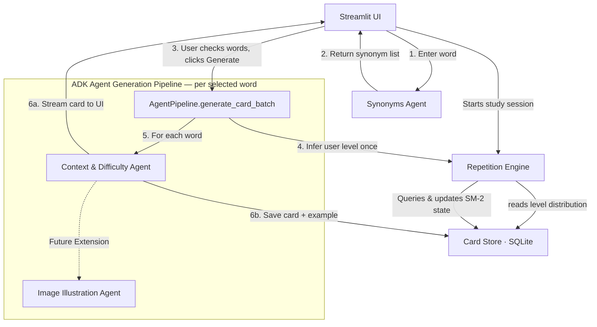

# EchoLoop Architecture and Implementation Plan

EchoLoop is a language-learning flashcard generator built as a multi-agent application. It turns simple German vocabulary inputs into rich, contextual, illustrated study cards (German to English) complete with context, difficulty estimation, synonyms, and spaced repetition scheduling.

We are designing this application using **Google's Agent Development Kit (ADK)** and deploying it to **Google Cloud Platform (GCP)**.

---

## Architecture & Technology Stack

- **Orchestration**: ADK (Agent Development Kit) agents coordinating sequentially.
- **Model**: Google Gemini Developer API models (e.g., `gemini-1.5-flash` or newer).
- **Deployment Target**: Google Cloud Platform (using `agent_runtime` or `cloud_run` via `agents-cli`).
- **Database**: Normalized SQLite database for cards, examples, synonyms, and reviews.
- **Frontend**: Streamlit (Python-only UI) for the MVP prototype.
- **Language Scope**: German (target language) to English (native/base language).

---

## User Flow — Card Generation

```
User enters one German word
        │
        ▼
SynonymsAgent  →  returns up to 5 synonyms
        │
        ▼
UI shows original word + synonyms as a checklist
User deselects any words they don't want cards for
        │
        ▼
[Generate] button
        │
        ▼
AgentPipeline.generate_card_batch(selected_words, inferred_level)
  ├── Infers user level once (RepetitionEngine.get_inferred_user_level())
  ├── For each selected word (original + checked synonyms):
  │     ContextAgent  →  FlashcardContext
  │     → Save card + example to CardStore   (skip if word already exists)
  │     → Stream card to UI as it arrives
  └── After all complete: show summary panel listing saved words
      (words that failed are listed separately at the end)
```



---

## Module Breakdown

### 1. Agentic Generation Pipeline (`AgentPipeline`)
- **Seam**: A single batch entry point called by the UI.
- **Implementation**: Written using the Google ADK Python SDK.
- **Orchestration**: Runs `SynonymsAgent` once on the entered word to get candidate words, then runs `ContextAgent` sequentially for each user-selected word (original + synonyms). Image generation is deferred as a future hook.
- **Interface**:
  - `def get_synonyms(word: str) -> SynonymsOutput` — calls `SynonymsAgent`; returns the structured synonym list so the UI can render the checklist.
  - `def generate_card_batch(words: list[str], inferred_level: str) -> Iterator[FlashcardResult]` — yields one `FlashcardResult` per word as each `ContextAgent` call completes; skips words already in the DB; captures per-word failures without aborting the batch.
- **`FlashcardResult`** (new data class):
  - `word: str`
  - `card: FlashcardContext | None` — `None` on failure or if word was already in DB
  - `status: Literal["saved", "skipped", "failed"]`
  - `error: str | None`

### 2. Storage Adapter (`CardStore`)
- **Seam**: An interface managing raw data persistence and queries.
- **Implementation**: SQLite database adapter using a normalized schema.
- **Schema**:
  - `cards`: `id`, `word`, `translation`, `detected_level`, `easiness_factor`, `interval_days`, `repetitions`, `next_review_date`
  - `examples`: `id`, `card_id` (FK), `sentence`, `translation`
  - `synonyms`: `id`, `card_id` (FK), `synonym_word`, `translation`
  - `reviews`: `id`, `card_id` (FK), `timestamp`, `rating_score`
- **Depth**: Hides raw connections, cursors, foreign key constraints, indices, and database-specific SQL queries.

### 3. Spaced Repetition Engine (`RepetitionEngine`)
- **Seam**: Coordinates study session assembly and calculates learning metrics.
- **Depth**: Houses the SM-2 algorithm calculation logic. Infers the user's level dynamically by analyzing the distribution of `detected_level` values in the existing `cards` database.
- **Interface**:
  - `def calculate_next_review(card: Card, review_score: int) -> CardMetrics`
  - `def get_inferred_user_level() -> str`

### 4. User Interface (`UI`)
- **Seam**: Interactive Streamlit interface — two pages.
- **Depth**: Hides view layout, form handling, streaming card display, progress bars, and transient session queues.

#### Page 1 — Add Card
1. Word input form.
2. On submit: call `AgentPipeline.get_synonyms(word)` → display checklist of original word + synonyms.
3. User checks/unchecks words → clicks **Generate**.
4. Calls `AgentPipeline.generate_card_batch(selected, inferred_level)` and streams results: each card appears as it arrives.
5. After all complete: summary panel — list of saved words + any failures.

#### Page 2 — Review (Interactive Session-based Review)
- Fetches all due cards upfront into `st.session_state`.
- Shows word prompt → reveal → 0–5 SM-2 rating → advance.
- End of session: summary + option to start another session.

---

## Design Decisions

| Decision | Choice | Rationale |
|---|---|---|
| Level inference timing | Once per batch | Simpler; consistent context for all cards in the batch |
| Already-in-DB words | Skip silently, status = `"skipped"` | Avoids duplicates without blocking the user |
| Batch failure handling | Skip failed words, report at end | Partial success is more useful than all-or-nothing |
| Card streaming | Stream as each arrives | Reduces perceived latency for large batches |
| Post-generation UX | Summary panel, stay on Add Card page | User may want to add another word immediately |

---

## Verification Plan

### Automated Tests
- Python unit tests (`uv run pytest`) verifying the SM-2 calculations in `RepetitionEngine` and CRUD joins in `CardStore`.
- Unit tests for `AgentPipeline.generate_card_batch` covering skip, failure, and happy-path status values.
- ADK-integrated evaluations (`agents-cli eval`) to verify agent language outputs and translation accuracy.

### Manual Verification
- Testing interactive card creation and reviews using the local Streamlit dashboard.
