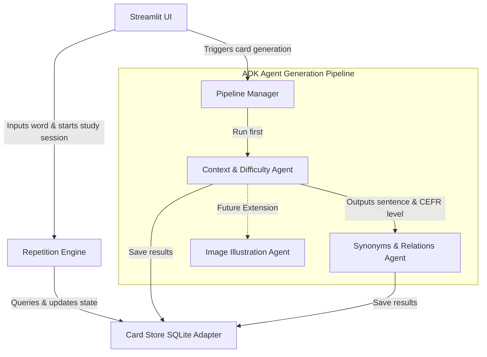

# EchoLoop Architecture and Implementation Plan

EchoLoop is a language-learning flashcard generator built as a multi-agent application. It turns simple German vocabulary inputs into rich, contextual, illustrated study cards (German to English) complete with context, difficulty estimation, synonyms, and spaced repetition scheduling.

We are designing this application using **Google's Agent Development Kit (ADK)** and deploying it to **Google Cloud Platform (GCP)**.

---

## Architecture & Technology Stack

- **Orchestration**: ADK (Agent Development Kit) agents coordinating sequentially.
- **Model**: Google Gemini Developer API models (e.g., `gemini-1.5-flash` or newer).
- **Deployment Target**: Google Cloud Platform (using `agent_runtime` or `cloud_run` via `agents-cli`).
- **Database**: Normalized SQLite database for cards, examples, synonyms, and reviews.
- **Frontend**: Streamlit (Python-only UI) for the MVP prototype.
- **Language Scope**: German (target language) to English (native/base language).

---

## Proposed Changes & Module Breakdown

### 1. Agentic Generation Pipeline (`AgentPipeline`)
- **Seam**: A clean Python interface wrapper over our ADK agents.
- **Implementation**: Written using the Google ADK Python SDK.
- **Orchestration**: A sequential pipeline executing the `ContextAgent` first (to establish the sentence, translation, and word difficulty), followed by the `SynonymsAgent`. Image generation is deferred as a future hook.
- **Interface**:
  - `async def generate_card(word: str, inferred_user_level: str) -> FlashcardData`

### 2. Storage Adapter (`CardStore`)
- **Seam**: An interface managing raw data persistence and queries.
- **Implementation**: SQLite database adapter using a normalized schema.
- **Schema**:
  - `cards`: `id`, `word`, `translation`, `detected_level`, `easiness_factor`, `interval_days`, `repetitions`, `next_review_date`
  - `examples`: `id`, `card_id` (FK), `sentence`, `translation`
  - `synonyms`: `id`, `card_id` (FK), `synonym_word`, `translation`
  - `reviews`: `id`, `card_id` (FK), `timestamp`, `rating_score`
- **Depth**: Hides raw connections, cursors, foreign key constraints, indices, and database-specific SQL queries.

### 3. Spaced Repetition Engine (`RepetitionEngine`)
- **Seam**: Coordinates study session assembly and calculates learning metrics.
- **Depth**: Houses the SM-2 algorithm calculation logic. Infers the user's level dynamically by analyzing the distribution of `detected_level` values in the existing `cards` database.
- **Interface**:
  - `def calculate_next_review(card: Card, review_score: int) -> CardMetrics`
  - `def get_inferred_user_level() -> str`

### 4. User Interface (`UI`)
- **Seam**: Interactive Streamlit interface.
- **Depth**: Hides view layout, form handling, card flip visuals, progress bars, and transient session queues. Runs in an **Interactive Session-based Review** pattern: fetches all due cards upfront and lets the user step through them.

---

## Verification Plan

### Automated Tests
- Python unit tests (`uv run pytest`) verifying the SM-2 calculations in `RepetitionEngine` and CRUD joins in `CardStore`.
- ADK-integrated evaluations (`agents-cli eval`) to verify agent language outputs and translation accuracy.

### Manual Verification
- Testing interactive card creation and reviews using the local Streamlit dashboard.
