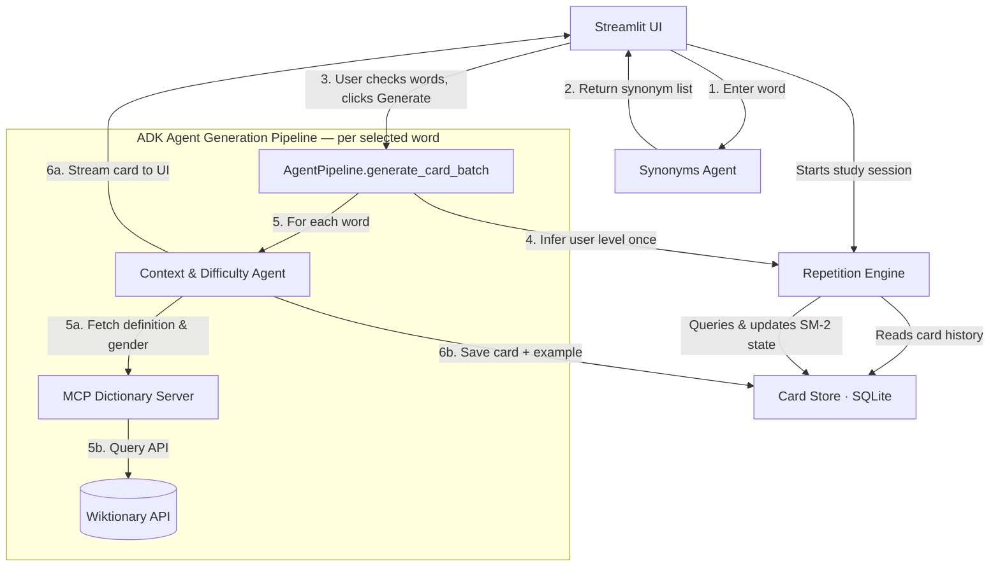

# EchoLoop 🔁

An AI-powered, multi-agent language learning application that utilizes collaborative LLM agents to dynamically generate contextual, adaptive flashcards powered by spaced repetition scheduling.

This project is a submission to the Kaggle [AI Agents: Intensive Vibe Coding Capstone Project](https://www.kaggle.com/competitions/vibecoding-agents-capstone-project) (Target Track: **Concierge Agents**).

---

## 🌟 Key Features

* **Multi-Agent Generation Pipeline**:
  * **Synonyms Agent**: Suggests up to 5 lexicographically matching German synonyms.
  * **Context Agent**: Analyzes selected words, infers target translation, estimates CEFR difficulty levels, and writes contextual German-English example sentences appropriate for the user's estimated level.
* **Model Context Protocol (MCP) Integration**: Binds a local FastMCP server (`lookup_german_word` tool) to the `ContextAgent` to fetch verified definitions and grammatical genders from the Wiktionary API, eliminating translation hallucinations.
* **Synonym Verification Checklist**: Allows you to check/uncheck generated synonyms before batch-generating flashcards.
* **Spaced Repetition Scheduler**: Employs the **SuperMemo-2 (SM-2)** scheduling algorithm (calculating Easiness Factor, repetitions, and intervals) to queue cards due for review.
* **Interactive Session-based Review**: Flip cards to see answers, rate your recall from 0 to 5, and dynamically save metrics.
* **Zero-Cost Secure Deployment**: Deploys to Google Cloud Run with GCS volume persistence and programmatic Google SSO (OAuth2) with email whitelisting to guarantee private access with $0.00 idle running costs.

---

## ⚡ EchoLoop vs. Alternatives

EchoLoop occupies a unique space, combining the robust scheduling of Anki with generative AI and interactive user verification.

| Dimension | Duolingo | Anki | Lingvist | **EchoLoop 🔁** |
| :--- | :--- | :--- | :--- | :--- |
| **Card Generation** | Static database | Manual creation | Static database | **Dynamic (Multi-Agent Pipeline)** |
| **Vocabulary Source** | Fixed curriculum | User-supplied | Fixed curriculum | **User-supplied (any custom word)** |
| **Recall Context** | Repetitive phrases | Plain text | Cloze sentences | **Custom Level-Targeted Sentences** |
| **Expansion Flow** | None | Manual search | None | **Interactive Synonym Checklist** |
| **External Verifier** | None | None | None | **Wiktionary API via MCP Tool** |
| **Infrastructure Cost** | Ad-supported/Paid | Free | Subscription | **Zero ($0.00 scale-to-zero GCP)** |

**The EchoLoop Advantage**: Standard flashcard apps force you into pre-made paths or demand tedious manual editing. EchoLoop lets you input *any* word you encounter, utilizes the **Synonyms Agent** to suggest vocabulary cluster expansions, lets you filter them, and delegates to the **Context Agent** to immediately write level-tailored study material.

---

## 🏗 System Architecture



---

## 📂 Repository Structure

```
.
├── .agents/                 # Customization rules and agent skills
├── echoloop/                # Main application package
│   ├── agents/              # ADK Agent definitions & MCP Server
│   │   ├── context_agent.py  # Context generation agent (calls MCP tool)
│   │   ├── synonyms_agent.py # Synonym generation agent
│   │   └── mcp_server.py     # Local Stdio FastMCP Dictionary Server
│   ├── app_utils/           # Telemetry and type specifications
│   ├── ui/                  # Streamlit Multi-page UI package
│   │   ├── pages/           # Pages (Add Card, Review)
│   │   ├── main.py          # Streamlit root entry point
│   │   └── styles.css       # Custom UI CSS styles
│   ├── cli.py               # CLI runner entry point
│   ├── pipeline.py          # Multi-agent orchestrator (AgentPipeline)
│   ├── repetition_engine.py # SM-2 Scheduler & CEFR level estimator
│   └── storage/             # SQLite connection, models, & APIs
│       ├── adapter.py        # Database CardStore CRUD operations
│       └── dictionary.py     # Wiktionary HTTP API client
├── terraform/               # Infrastructure as Code (GCP)
├── tests/                   # Test suite (unit & integration)
├── Dockerfile               # Production container definition
├── deploy.sh                # Automated build & deployment script
└── pyproject.toml           # Project metadata & dependencies
```

---

## 💻 Local Setup

### Prerequisites
* [Python 3.14+](https://www.python.org/)
* [uv](https://github.com/astral-sh/uv) (recommended Python package manager)

### Installation
1. **Clone the repository**:
   ```bash
   git clone https://github.com/khrapovs/echoloop-multiagent-flashcards.git
   cd echoloop-multiagent-flashcards
   ```

2. **Install dependencies**:
   ```bash
   uv sync --all-extras
   ```

3. **Set API credentials**:
   Set your Google Gemini API Key:
   ```bash
   export GOOGLE_API_KEY="your-key-here"
   ```

4. **Launch the interface**:
   ```bash
   uv run echoloop
   ```
   This will spin up Streamlit and open the UI at [http://localhost:8501](http://localhost:8501).

### Code Quality (Pre-commits & Linting)
Before submitting code, ensure that all linting checks pass. The project uses `prek` for checking commits:

```bash
prek install
```

Run linting manually

```bash
uv run prek run -v --show-diff-on-failure
uv run ty check
```

### Running Tests
Make sure the entire test suite passes successfully.

* **Run Unit Tests** (offline/mocked):
  ```bash
  uv run pytest tests/unit -v
  ```
* **Run Integration Tests** (requires `GOOGLE_API_KEY`):
  ```bash
  uv run pytest tests/integration -v
  ```

### Evaluating Agents
We use the **Google Agent Development Kit (ADK)** evaluation suite to run automated benchmark runs and grade output quality.

1. **Generate traces** (runs the agent against the test cases in `tests/eval/datasets/basic-dataset.json`):
   ```bash
   agents-cli eval generate
   ```
2. **Grade results** (calculates pass/fail rates on language quality and structured schema compliance):
   ```bash
   agents-cli eval grade
   ```
3. **Analyze failures** (clusters outputs to find common error domains):
   ```bash
   agents-cli eval analyze
   ```

---

## 🚀 Deployment to Google Cloud Platform (GCP)

EchoLoop uses **Terraform** to deploy a containerized environment to **Google Cloud Run** using a cost-efficient scale-to-zero serverless profile.

### Prerequisites
1. [Google Cloud SDK (`gcloud`)](https://cloud.google.com/sdk) installed and authenticated.
2. [Terraform CLI](https://developer.hashicorp.com/terraform/downloads) installed locally.
3. Authenticate Application Default Credentials (ADC) for Terraform:
   ```bash
   gcloud auth application-default login
   gcloud auth application-default set-quota-project <YOUR-PROJECT-ID>
   ```

### Execution Steps
To bootstrap infrastructure and deploy the application:

1. **Configure deployment variables**:
   Copy the example environment configuration file and fill in your variables (GCP project, state bucket, and Google OAuth Client ID/Secret):
   ```bash
   cp .env-example .env
   # Open .env in your editor and configure the variables
   ```

2. **Run the deployment orchestrator script**:
   ```bash
   ./deploy.sh
   ```
   *This script reads configurations from your `.env` file, validates credentials, bootstraps the GCS state bucket, builds the container via Cloud Build, and deploys to Cloud Run.*

3. **Access your service**:
   The script outputs your Cloud Run Service URL:
   ```
   Your EchoLoop UI is accessible at: https://echoloop-ui-xxxxxx.a.run.app
   ```
   *Only users logging in with whitelisted email addresses will be granted access to the application.*
