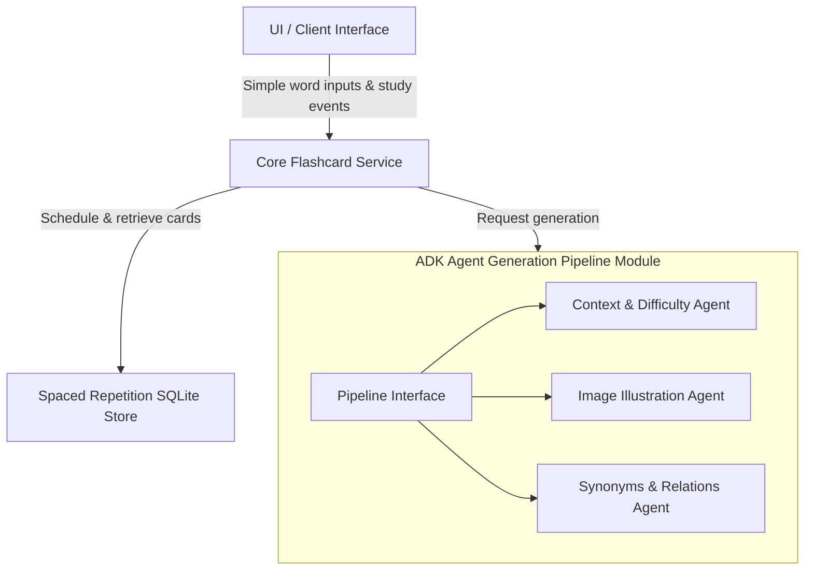

# EchoLoop Architecture and Implementation Plan

EchoLoop is a language-learning flashcard generator designed as a multi-agent application. It turns simple vocabulary words into rich, contextual, illustrated study cards (German to English) complete with context, difficulty estimation, image illustrations, synonyms, and spaced repetition scheduling.

We are designing this application using **Google's Agent Development Kit (ADK)** and deploying it to **Google Cloud Platform (GCP)**.

---

## Architecture & Technology Stack

- **Orchestration**: ADK (Agent Development Kit) agents coordinating to perform sub-tasks.
- **Model**: Google Gemini Developer API models (e.g., `gemini-1.5-flash` or newer).
- **Deployment Target**: Google Cloud Platform (using `agent_runtime` or `cloud_run` via `agents-cli`).
- **Database**: SQLite for local lightweight spaced repetition scheduling storage.
- **Language Scope**: German (learning language) to English (base language).

---

## Proposed Changes & Module Breakdown

### 1. Agentic Generation Pipeline (`AgentPipeline`)
- **Seam**: A clean Python interface wrapper over our ADK agents.
- **Implementation**: Written using the Google ADK Python SDK.
- **Depth**: Hides prompt designs, agent collaboration schemas, model parameters, API retries, and concurrent agent execution.
- **Interface**:
  - `async def generate_card(word: str, user_level: str) -> FlashcardData`

### 2. Spaced Repetition & Storage Module (`CardStore`)
- **Seam**: An interface managing card state and scheduling algorithms (SM-2/Anki-style spaced repetition).
- **Implementation**: SQLite database adapter.
- **Depth**: Hides DB connection pooling, schema migrations, raw SQL queries, and the mathematical formula for calculating next-review intervals.
- **Interface**:
  - `def save_card(card: FlashcardData) -> None`
  - `def get_due_cards() -> List[FlashcardData]`
  - `def record_review(card_id: str, quality_score: int) -> None`

### 3. User Interface / Controller Module (`UI`)
- **Seam**: A clean command-line interface (CLI) or a lightweight web server (e.g., FastAPI) wrapper for interactive use.
- **Depth**: Focuses on rendering outputs, managing interactive loops, and handling user inputs, completely separated from generation logic and database queries.

---

## Verification Plan

### Automated Tests
- Python unit tests (`uv run pytest`) verifying the SM-2 scheduling algorithm and SQLite operations.
- ADK-integrated evaluations (`agents-cli eval`) to verify agent output formatting, language accuracy (German/English translation), and level appropriateness.

### Manual Verification
- Testing interactive card reviews using a local run or the ADK playground (`agents-cli playground`).
